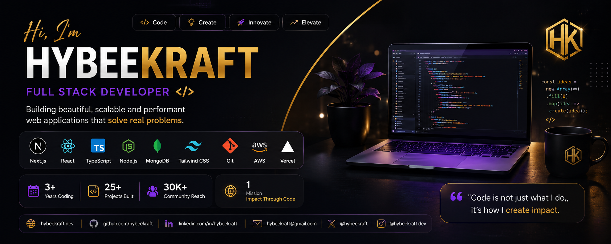

# 👋 Hi, I'm Hybeekraft

### Full Stack Developer • Next.js • Node.js • MongoDB • TypeScript

---

# 🚀 About Me

I'm a passionate **Full Stack Developer** focused on building modern, scalable, and user-friendly web applications.

I enjoy transforming ideas into polished digital products with beautiful UI, clean architecture, and reliable backend systems.

Currently building products using:

- ⚡ Next.js
- ⚡ React
- ⚡ TypeScript
- ⚡ Node.js
- ⚡ MongoDB
- ⚡ Tailwind CSS
- ⚡ Vercel

---

# 🛠 Tech Stack

---

# 🚀 Featured Projects

## ✨ Sposh Appeal

Luxury Salon Booking Platform

### Features

- 📅 Online Appointment Booking
- 👩 Admin Dashboard
- 📧 Email Notifications
- 💳 Payment Integration
- 📱 Mobile Responsive
- ⚡ Lightning Fast
- 🔒 Secure Authentication

### Tech

Next.js • MongoDB • Node.js • Tailwind CSS

🔗 **Live Demo**

https://sposhappeal.vercel.app

🔗 **Repository**

https://github.com/hybeekraft/sposhappeal

---

# 📈 GitHub Statistics

---

# 🏆 GitHub Trophies

---

# 📊 Contribution Graph

---

# 🔥 Currently Working On

- 🚀 Sposh Appeal Version 2
- 📊 Admin Analytics Dashboard
- 🤖 AI-powered Booking Assistant
- ☁️ AWS Deployment
- ⚡ Performance Optimization

---

# 📚 Currently Learning

- Docker
- Kubernetes
- AWS
- Redis
- CI/CD
- System Design

---

# 🌍 Connect With Me

---

# 💡 Fun Facts

- 💻 I enjoy building products people love.
- 🎨 UI/UX matters just as much as clean code.
- ☕ Coffee and late-night coding sessions fuel my creativity.
- 🚀 Always learning and improving.

---

### ⭐ Thanks for stopping by!

_"Code is more than writing software—it's about solving problems and creating impact."_

